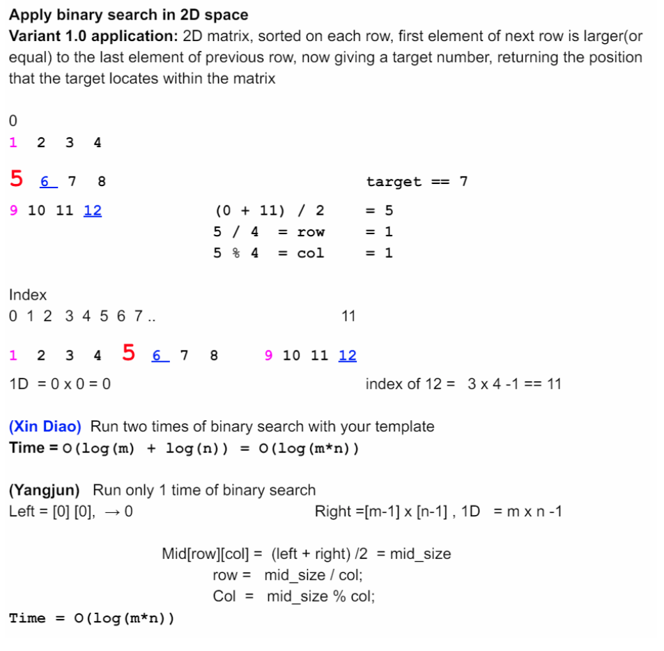

<!----- Conversion time: 1.017 seconds.


Using this Markdown file:

1. Cut and paste this output into your source file.
2. See the notes and action items below regarding this conversion run.
3. Check the rendered output (headings, lists, code blocks, tables) for proper
   formatting and use a linkchecker before you publish this page.

Conversion notes:

* GD2md-html version 1.0β13
* Tue Jan 15 2019 04:22:50 GMT-0800 (PST)
* Source doc: https://docs.google.com/open?id=1bCVjBRvaxpvidOdfuMY0ZUAqufy_UGSl4dxb_FvNERo
* This document has images: check for >>>>>  gd2md-html alert:  inline image link in generated source and store images to your server.
----->

# Search in Sorted Matirx I

[https://app.laicode.io/app/problem/267](https://app.laicode.io/app/problem/267)

## Description

Given a 2D matrix that contains integers only, which each row is sorted in an ascending order. The first element of next row is larger than (or equal to) the last element of previous row.

Given a target number, returning the position that the target locates within the matrix. If the target number does not exist in the matrix, return {-1, -1}.

Assumptions:

- The given matrix is not null, and has size of N \* M, where N >= 0 and M >= 0.
-

Examples:

matrix = { {1, 2, 3}, {4, 5, 7}, {8, 9, 10} }

target = 7, return {1, 2}

target = 6, return {-1, -1} to represent the target number does not exist in the matrix.

Medium

Array

Binary Search

## Algorithm

**Total number of columns = matrix\[0\].length;**

**Total length = total number of rows \* total number of columns - 1**

**row = mid / total number of columns;**

**col = mid % total number of columns;**



## Solution

### Code

```java
public class Solution {

  public int[] search(int[][] matrix, int target) {
    // Write your solution here
    if (matrix == null || matrix[0].length == 0) {
      return new int[] { -1, -1 };
    }

    int m = matrix.length;
    int n = matrix[0].length;

    int start = 0;
    int end = m * n - 1;
    while (start <= end) {
      int mid = start + (end - start) / 2;
      int row = mid / n;
      int col = mid % n;
      if (matrix[row][col] == target) {
        return new int[] { row, col };
      } else if (matrix[row][col] < target) {
        start = mid + 1;
      } else {
        end = mid - 1;
      }
    }
    return new int[] { -1, -1 };
  }
}
```

### Complexity

Time:

Binary search narrows down the searching range by half each time ⇒ O(log(n))

Space:

Constant space ⇒ O(1)

<!-- GD2md-html version 1.0β13 -->
