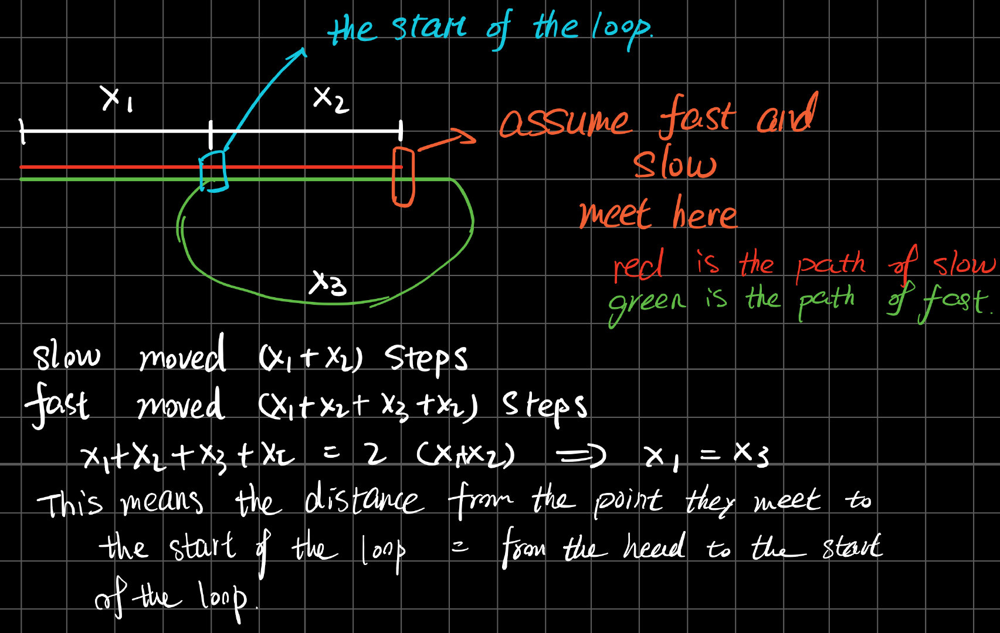

# Cycle Node in Linked List

[https://app.laicode.io/app/problem/38](https://app.laicode.io/app/problem/38)

[https://leetcode.com/problems/linked-list-cycle-ii](https://leetcode.com/problems/linked-list-cycle-ii)

## Description

Check if a given linked list has a cycle. Return the node where the cycle starts. Return null if there is no cycle.

**Medium**

**Linked List**

**Two Pointers**

## Assumption

The linked list should be a singly-linked, non-null linked list.

## Algorithm

The high level idea to tackle this problem is to

1.  Make sure there is a cycle in the linked list
2.  Look for the node where the cycle starts

To implement a solution, we need to figure out the two steps separately.

1.  Determine if there is a cycle in a given linked list
    1.  [Check if Linked List Has a Cycle](../../Easy/CheckIfLinkedListHasACycle)
2.  Look for the starting node of the cycle 1.

    1.  To understand this solution, you just need to ask yourself these question.

        1.  Assume the distance from head to the start of the loop is x1
        2.  the distance from the start of the loop to the point fast and slow meet is x2
        3.  the distance from the point fast and slow meet to the start of the loop is x3
        4.  What is the distance fast moved? What is the distance slow moved? And their relationship?

            1.  d(fast) = x1 + x2 + x3 + x2
            2.  d(slow) = x1 + x2
            3.  d(fast) = 2 \* d(slow) ⇒ x1 + x2 + x3 + x2 = 2 (x1 + x2)
            4.  Thus x1 = x3

                Finally got the idea.



**It is important that both slow and fast start moving from the head such that the distances they cover will always be calculated from the same point**

## Solution

### Code

```java
/**
 * class ListNode {
 *   public int value;
 *   public ListNode next;
 *   public ListNode(int value) {
 *     this.value = value;
 *     next = null;
 *   }
 * }
 */
public class Solution {

  public ListNode cycleNode(ListNode head) {
    // write your solution here
    // Step 1: determine if there is a cycle in the linked list
    ListNode slow = head;
    ListNode fast = head;
    boolean hasCycle = false;
    while (fast != null && fast.next != null) {
      slow = slow.next;
      fast = fast.next.next;
      if (slow == fast) {
        hasCycle = true;
        break;
      }
    }
    // Proceed only if there is a cycle
    if (!hasCycle) {
      return null;
    }
    // Step 2: look for the starting node of the cycle
    // a. Distance covered by the slow pointer:
    //    distance(head, start) + distance(start, meet)
    // b. Distance covered by the fast pointer:
    //    distance(head, start) + distance(start, meet) +
    //    distance(meet, start) + distance(start, meet)
    // Because b = 2 * a ==>
    // Therefore, distance(head, start) == distance(meet, start)
    // So, let slow moves one step at a time from the head
    //     let fast moves one step at a time from the meeting point
    // They will meet at the starting point of the cycle
    slow = head;
    while (slow != fast) {
      slow = slow.next;
      fast = fast.next;
    }
    return slow;
  }
}
```

### Complexity

#### Time

Step 1 takes O(n) to look for the presence of a cycle in the linked list.

Step 2 takes O(n) to look for the starting node of the cycle.

Therefore, O(n).

#### Space

Only ListNode objects with constant spaces were created ⇒ O(1)
