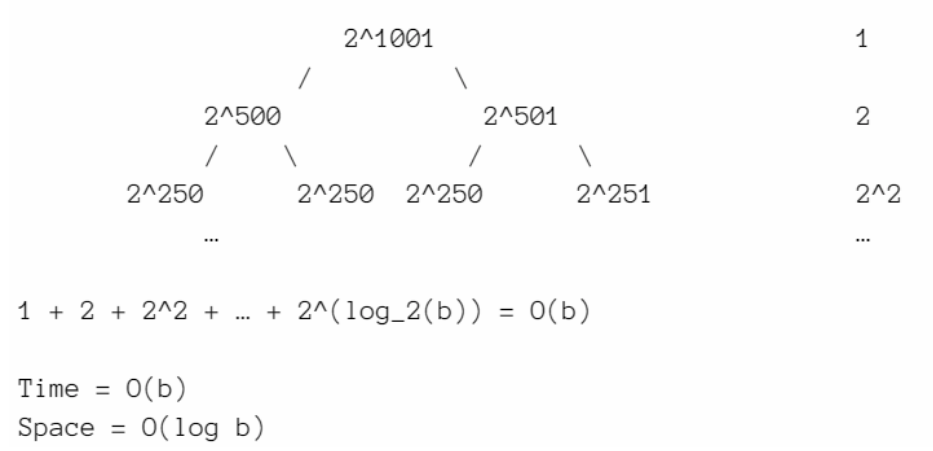
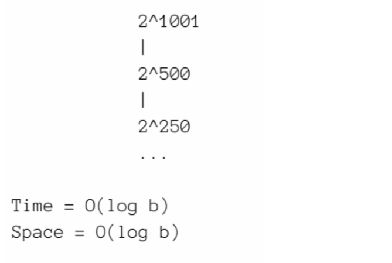

# A to the Power of B

[https://app.laicode.io/app/problem/13](https://app.laicode.io/app/problem/13)

## Description

    Evaluate a to the power of b, assuming both a and b are integers and b is non-negative.


    Examples

- power(2, 0) = 1
- power(2, 3) = 8
- power(0, 10) = 0
- power(-2, 5) = -32

  Corner Cases

- What if the result is overflowed? We can assume the result will not be overflowed when we solve this problem on this online judge.

Medium

Math

## Assumption

- The input should both be integers (b has to be non-negative).
- What if the result is overflowed? We can assume the result will not be overflowed when we solve this problem on this online judge.

## Algorithm

1.  Naive method
    1.  Base case: b == 0 ⇒ (any integer) ^ 0 == 1
    1.  Calculate the result one level at a time by calling power(a, b - 1);
    1.  return a \* power(a, b - 1);
1.  Improved method

    1.  Base case
        1.  b == 0 ⇒ 0
        1.  b == 1 ⇒ a because there could be odd number of subproblems
    1.  Calculate the result by cutting the recursion tree by half: mid = b / 2

        


    1.  return power(a, mid) * power(a, b - mid);

1.  Optimized method
    1.  Base case: b == 0
    1.  Calculate the result by getting half result first, and manipulate upon the half result
        1.  if b is even ⇒ return half \* half
        1.  if b is odd ⇒ return half _ half _ a

## Solution

### Method 1: naive

#### Code

```java
public class Solution {

  public long power(int a, int b) {
    if (b == 0) {
      return 1;
    }
    return power(a, b - 1) * a;
  }
}
```

#### Complexity

Time:

n nodes in 2^n levels

each node takes O(1) operation

⇒ O(2^n)

Space:

n nodes to check ⇒ O(n)


### Method 2: improved → check both ways

The amount of computation can be lower if we divide the problem/subproblems in half

For example, to compute 2^1001

2^1001 == 2^500 \* 2^501

                                                                2^1001

                                                              /              \

                                                    2^500               2^501

                                                    /        \                /      \

                                           2^250   2^250   2^250    2^251

In total, there are 1 + 2 + 2^2 + … + 2^(log(b)) levels

Time = O(b)

Space = O(log(b))

#### Code

```java
public class Solution {

  public long power(int a, int b) {
    if (b == 0) {
      return 1;
    } else if (b == 1) {
      return a;
    }
    int mid = b / 2;
    return power(a, mid) * power(a, b - mid);
  }
}
```

#### Complexity

Time: total number of nodes = b ⇒ O(b)

Space: log(b) levels of recursion tree that has b nodes ⇒ O(log(b))



### Method 3: optimized → divide into two halves and combine

We can further divide the cases into two situations: odd vs even powers. Such that the time complexity can be decreased to O(log(b))

#### Code

```java
public class Solution {

  public long power(int a, int b) {
    if (b == 0) {
      return 1;
    }
    long half = power(a, b / 2);
    if (b % 2 == 0) {
      return half * half;
    }
    return (long) a * half * half;
  }
}
```

#### Complexity

Time: there are only log(n) levels in the recursion tree because we divide the number of subproblems by ½ each time ⇒ O(log(n))

Space: since the recursion tree has log(n) levels ⇒ O(log(n)).


