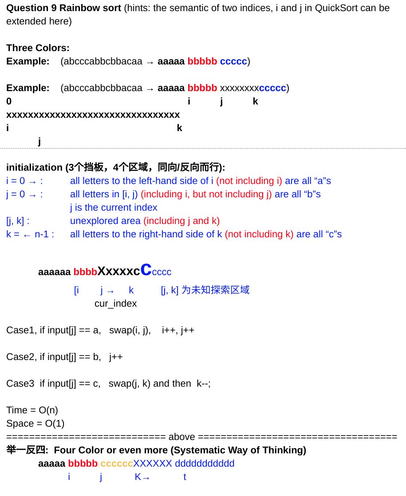

# Rainbow Sort

[https://app.laicode.io/app/problem/11](https://app.laicode.io/app/problem/11)

## Description

Given an array of balls, where the color of the balls can only be Red, Green or Blue, sort the balls such that all the Red balls are grouped on the left side, all the Green balls are grouped in the middle and all the Blue balls are grouped on the right side. (Red is denoted by -1, Green is denoted by 0, and Blue is denoted by 1).

Examples

- {0} is sorted to {0}
- {1, 0} is sorted to {0, 1}
- {1, 0, 1, -1, 0} is sorted to {-1, 0, 0, 1, 1}

Assumptions

- The input array is not null.

Corner Cases

- What if the input array is of length zero? In this case, we should not do anything as well.

## Assumption

The input array should not be null or empty. The tree colors, green, red, and blue, are represented by -1, 0, and 1.

## Algorithm

The high level basic idea is that this problem may be solved by a quick sort variant method.

Instead of picking an element as pivot each time, an extra pointer/barrier can be used for this problem because there
are 3 different colors.

The three pointers represents:

1.  Everything to the left of i (array\[0, i]) are all red
1.  Everything between i and j (array(i, j]) are green
1.  Everything after k (array\[k, end]) are blue
1.  Everything between j and k (array(j, k)) are unknown area

Because array(j, k) are the area to explore, we only care about array\[j] each time when checking the possible cases



## Solution

### Code

```java
public class Solution {

  public int[] rainbowSort(int[] array) {
    // Write your solution here
    if (array == null || array.length <= 1) {
      return array;
    }
    // Three pointers/barriers and four areas
    // array[0, i] are all -1
    // array(i, j] are all 0
    // array[k, n] are all 1
    // array(j, k) are unknown area to be explore
    int i = 0;
    int j = 0;
    int k = array.length - 1;
    while (j <= k) {
      // Because only array(j, k) is unknown area and needs
      // to explore, we only care about checking cases of array[j]
      if (array[j] == -1) {
        swap(array, i++, j++);
      } else if (array[j] == 0) {
        j++;
      } else if (array[j] == 1) {
        swap(array, j, k--);
      }
    }
    return array;
  }

  private void swap(int[] array, int left, int right) {
    int temp = array[left];
    array[left] = array[right];
    array[right] = temp;
  }
}
```

### Complexity

#### Time

One single iteration over the entire array does the job ⇒ O(n)

#### Space

Nothing declared on the heap ⇒ O(1)
