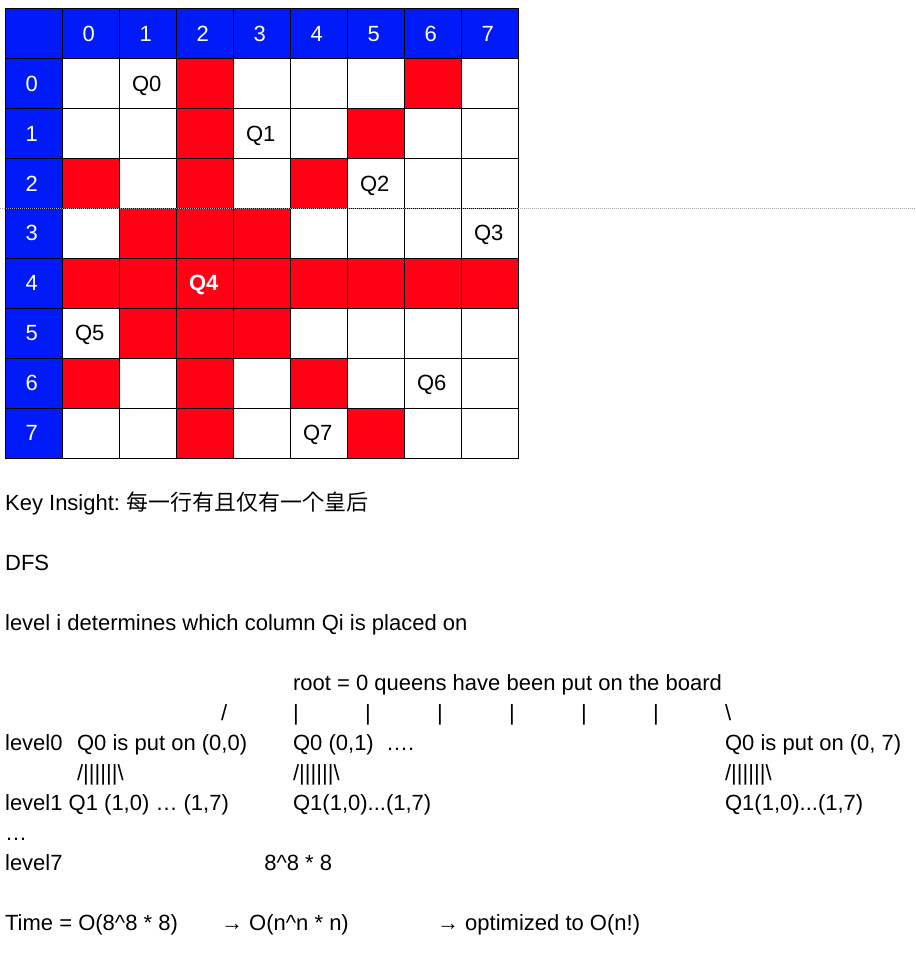

<!----- Conversion time: 1.311 seconds.


Using this Markdown file:

1. Cut and paste this output into your source file.
2. See the notes and action items below regarding this conversion run.
3. Check the rendered output (headings, lists, code blocks, tables) for proper
   formatting and use a linkchecker before you publish this page.

Conversion notes:

* Docs to Markdown version 1.0β14
* Tue Jan 22 2019 02:27:19 GMT-0800 (PST)
* Source doc: https://docs.google.com/open?id=1Ycevnu9dNo9r649LJ7Rug5hq0mpZ9eYqIkDsBNxgoFg
* This document has images: check for >>>>>  gd2md-html alert:  inline image link in generated source and store images to your server.
----->


# N Queens

[https://app.laicode.io/app/problem/233](https://app.laicode.io/app/problem/233)


## Description

Get all valid ways of putting N Queens on an N * N chessboard so that no two Queens threaten each other.

Assumptions


*   N > 0

Return


*   A list of ways of putting the N Queens
*   Each way is represented by a list of the Queen's y index for x indices of 0 to (N - 1)

Example

N = 4, there are two ways of putting 4 queens:

\[1, 3, 0, 2] --> the Queen on the first row is at y index 1, the Queen on the second row is at y index 3, the Queen on the third row is at y index 0 and the Queen on the fourth row is at y index 2.

\[2, 0, 3, 1] --> the Queen on the first row is at y index 2, the Queen on the second row is at y index 0, the Queen on the third row is at y index 3 and the Queen on the fourth row is at y index 1.

Medium

Backtracking

Depth First Search


## Assumption

N > 0 ⇒ the imaginary chessboard cannot be null


## Algorithm





1.  Base case: the last row has been explored; no more rows left to try
1.  Iff position (i, j) is valid → go to the next level (i + 1)


## Solution


### Code


```java
public class Solution {
  public List<List<Integer>> nqueens(int n) {
    // Write your solution here
    List<List<Integer>> result = new ArrayList<>();
    if (n <= 0) {
      return result;
    }
    // Do DFS searching for valid positions on each row
    // There could be at most one queen per row
    // In each row, try all opening columns and see
    // if placing a queen there is valid
    dfsPlaceQueens(n, new ArrayList<>(), result);
    return result;
  }

  private void dfsPlaceQueens(int n, List<Integer> current,
                              List<List<Integer>> result) {
    // Base case: when all queens have been placed
    if (current.size() == n) {
      result.add(new ArrayList<>(current));
      return;
    }
    // Each DFS level is represented by each row
    // In each row, we try all possible columns
    for (int i = 0; i < n; i++) {
      // Only place the queen at valid positions
      if (canPlaceQueen(current, i)) {
        current.add(i);
        // Go to the next level and try to place the next queen
        dfsPlaceQueens(n, current, result);
        // Backtracking
        current.remove(current.size() - 1);
      }
    }
  }

  private boolean canPlaceQueen(List<Integer> queens, int column) {
    // # of rows processed == # of queens placed == row #
    int row = queens.size();
    // There are "row" number of queens on the board so far
    for (int i = 0; i < row; i++) {
      // Two situations will fail the placement
      // 1. there are some other queens in the same column
      // 2. there are some other queens on the diagonal
      if (queens.get(i) == column ||
          Math.abs(queens.get(i) - column) == row - i) {
        // Case 2 is expressed by the slope of diagonal
        // diff(col) / diff(row)
        // Since diff(row) could be 0, we do
        // diff(col) == diff(row) instead
        return false;
      }
    }
    return true;
  }
}
```


### Complexity


#### Time

For each queen, there are n possible columns and it takes O(n) to see if a certain column is valid. We do this for all n queens ⇒ O(n^n * n) ⇒ O(n^n) ⇒ optimized to O(n!)


#### Space

We need to put n queens ⇒ n DFS calls ⇒ O(n)


<!-- Docs to Markdown version 1.0β14 -->
