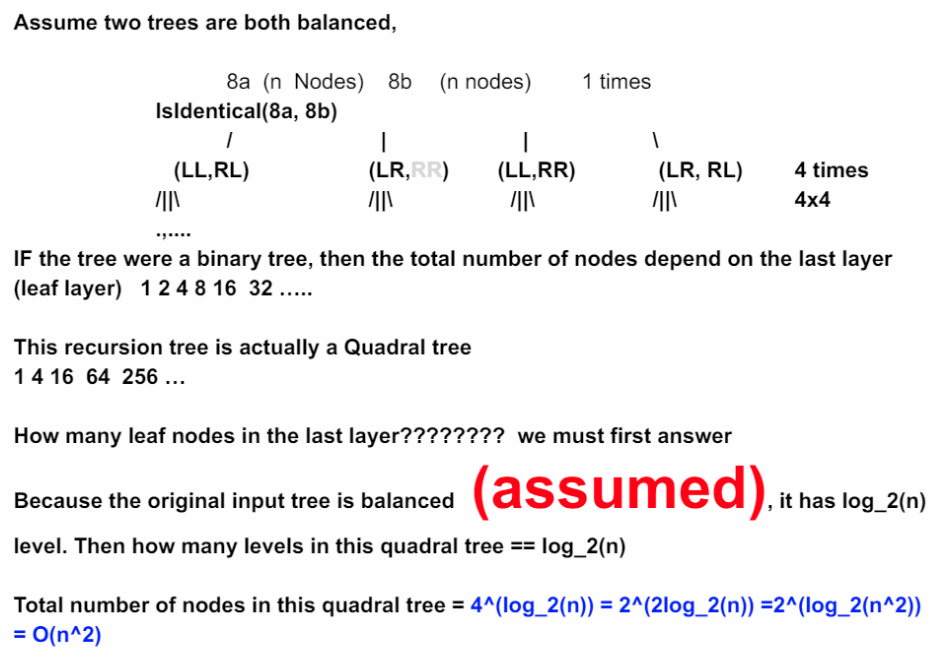

<!----- Conversion time: 1.143 seconds.


Using this Markdown file:

1. Cut and paste this output into your source file.
2. See the notes and action items below regarding this conversion run.
3. Check the rendered output (headings, lists, code blocks, tables) for proper
   formatting and use a linkchecker before you publish this page.

Conversion notes:

* GD2md-html version 1.0β13
* Sat Jan 05 2019 02:47:56 GMT-0800 (PST)
* Source doc: https://docs.google.com/open?id=1g_xuziexA36NzNXB79_uVewaXkMzF7Yhjxs__iw7jbU
* This document has images: check for >>>>>  gd2md-html alert:  inline image link in generated source and store images to your server.
----->


<p style="color: red; font-weight: bold">>>>>>  gd2md-html alert:  ERRORs: 0; WARNINGs: 0; ALERTS: 1.</p>
<ul style="color: red; font-weight: bold"><li>See top comment block for details on ERRORs and WARNINGs. <li>In the converted Markdown or HTML, search for inline alerts that start with >>>>>  gd2md-html alert:  for specific instances that need correction.</ul>

<p style="color: red; font-weight: bold">Links to alert messages:</p><a href="#gdcalert1">alert1</a>

<p style="color: red; font-weight: bold">>>>>> PLEASE check and correct alert issues and delete this message and the inline alerts.<hr></p>


## Tweaked Identical Binary Trees

[https://app.laicode.io/app/problem/50](https://app.laicode.io/app/problem/50)


## Description

Determine whether two given binary trees are identical assuming any number of 'tweak's are allowed. A tweak is defined as a swap of the children of one node in the tree.

Examples

            5

          /    \

        3        8

      /   \

    1      4

and

            5

          /    \

        8        3

               /   \

              1     4

the two binary trees are tweaked identical.

How is the binary tree represented?

We use the level order traversal sequence with a special symbol "#" denoting the null node.

For Example:

The sequence \[1, 2, 3, #, #, 4\] represents the following binary tree:

        1

      /   \

     2     3

          /

        4

Medium

Binary Tree


## Assumption

The tree is not null or empty


## Algorithm

Similar to the [Symmetric Binary Tree](https://docs.google.com/document/d/1j0kOdBO7BXmOrrkU8OyUNPB7jd74HB6eTziyMqjyrRo/edit) problem.

Instead of just comparing


1.  the left child of the left subtree with the right child of the right subtree
1.  the right child of the left subtree with the left child of the right subtree

We need to check:


1.  the _left child_ of the _left subtree_ with the _right child _of the _right subtree_
1.  the _right child _of the _left subtree_ with the _left child _of the _right subtree_
1.  the _left child_ of the _left subtree_ with the _left child _of the _right subtree_
1.  the _right child _of the _left subtree _with the _right child _of the _right subtree_

(1 && 2) || (3 && 4) ⇒ true


## Solution


### Code


```java
/**
 * public class TreeNode {
 *   public int key;
 *   public TreeNode left;
 *   public TreeNode right;
 *   public TreeNode(int key) {
 *     this.key = key;
 *   }
 * }
 */
public class Solution {
  public boolean isTweakedIdentical(TreeNode one, TreeNode two) {
    // Write your solution here
    // Case 1: if both of the nodes are null ==> identical
    // Case 2: if either of the nodes is null ==> different
    // Case 3: if both of the nodes are not null, but keys are different ==> different
    if (one == null && two == null) {
      return true;
    } else if (one == null || two == null) {
      return false;
    } else if (one.key != two.key) {
      return false;
    }
    // Recursively check if
    // 1. left.left == right.right && left.right == right.left
    //    ||
    // 2. left.left == right.left && left.right == right.right
    return isTweakedIdentical(one.left, two.right) && isTweakedIdentical(one.right, two.left) ||
        isTweakedIdentical(one.left, two.left) && isTweakedIdentical(one.right, two.right);
  }
}
```


### Complexity

Time: we need to check all n nodes ⇒ O(n)

Space: recursion tree depends on the height of the tree ⇒ O(height)


## Additional Notes


<p id="gdcalert1" ><span style="color: red; font-weight: bold">>>>>>  gd2md-html alert: inline image link here (to images/Tweaked-Identical0.png). Store image on your image server and adjust path/filename if necessary. </span><br>(<a href="#">Back to top</a>)(<a href="#gdcalert2">Next alert</a>)<br><span style="color: red; font-weight: bold">>>>>> </span></p>





<!-- GD2md-html version 1.0β13 -->
