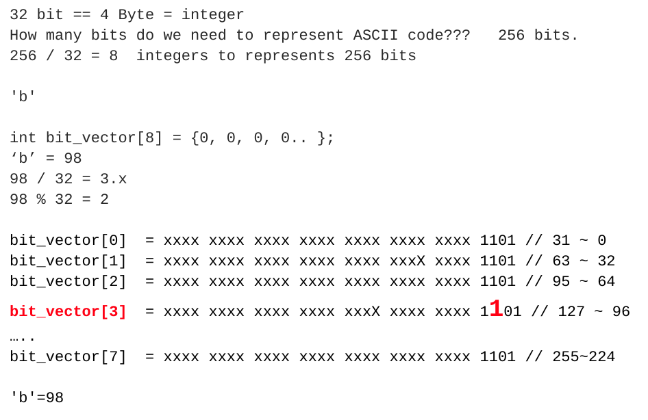

<!----- Conversion time: 1.605 seconds.


Using this Markdown file:

1. Cut and paste this output into your source file.
2. See the notes and action items below regarding this conversion run.
3. Check the rendered output (headings, lists, code blocks, tables) for proper
   formatting and use a linkchecker before you publish this page.

Conversion notes:

* GD2md-html version 1.0β13
* Mon Jan 14 2019 04:24:10 GMT-0800 (PST)
* Source doc: https://docs.google.com/open?id=1X-AmdERuhB1OEszGJU4DN68RrdatBo5Srhhv1Ktvqg4
* This document has images: check for >>>>>  gd2md-html alert:  inline image link in generated source and store images to your server.
----->


# All Unique Character II

[https://app.laicode.io/app/problem/77](https://app.laicode.io/app/problem/77)


## Description

Determine if the characters of a given string are all unique.

Assumptions


*   We are using ASCII charset, the value of valid characters are from 0 to 255
*   The given string is not null

Examples


*   all the characters in "abA+\8" are unique
*   "abA+\a88" contains duplicate characters


## Assumption

The input should be ASCII characters.


## Algorithm

We can easily solve this problem by using a hash table (HashMap or a boolean array of length 256). However, these methods are not implemented for this problem since it is a little too easy.

If we are getting inputs that are only lowercase letters, we can use an integer that has a bigger size than 26 bits, which an integer is, we can use each bit to represent the presence/absence of the corresponding character:

	 z  y  x  ...  c  b  a

	25 24 23      2  1  0


1.  If the letter 'c' is seen, we mark the third bit to 1 by: number | (1 << 2)
1.  If we need to see if the letter has been seen:
    1.  ((letter - 'a') >> k) & 1 == 1

We can expand this method to solve ASCII inputs


1.  256 bits needed to represent the 256 ASCII characters
    1.  256 / 32 == 8
    1.  int\[8\] will be sufficient to represent the 256 bits
1.  calculate the character's corresponding position in the array
    1.  row = char / 32
    1.  col = char % 32





## Solution


### Code


```java
public class Solution {
  public boolean allUnique(String word) {
    // Write your solution here
    if (word == null || word.length() <= 1) {
      return false;
    }
    // Use an integer array that has enough bits to represent 256 characters
    int[] occurred = new int[256 / 32];
    for (int i = 0; i < word.length(); i++) {
      char ch = word.charAt(i);
      // Calculate the corresponding position of the character
      int row = ch / 32;
      int col = ch % 32;
      // Check if this character has occurred before
      if (((occurred[row] >> col) & 1) == 1) {
        return false;
      }
      // Mark the corresponding bit to 1
      occurred[row] |= 1 << col;
    }
    return true;
  }
}
```


### Complexity


#### Time

There are at most 256 characters, for each character, we will do at most 32 right/left shift ⇒ O(256 * 32)


#### Space

int\[8\] used ⇒ O(8)


<!-- GD2md-html version 1.0β13 -->
