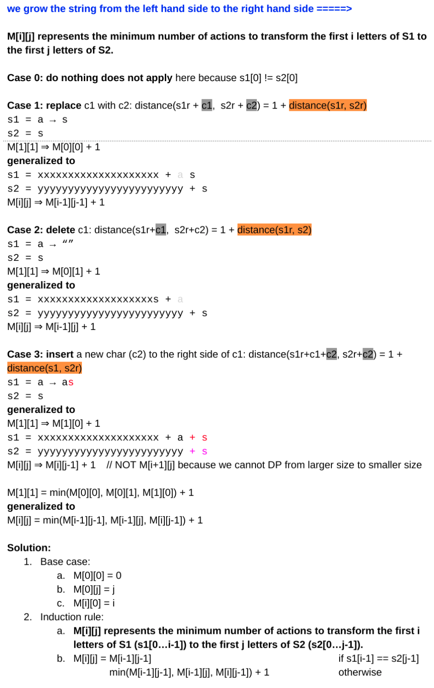
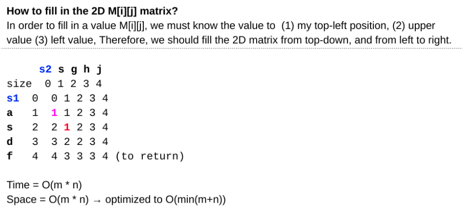

<!----- Conversion time: 2.605 seconds.


Using this Markdown file:

1. Cut and paste this output into your source file.
2. See the notes and action items below regarding this conversion run.
3. Check the rendered output (headings, lists, code blocks, tables) for proper
   formatting and use a linkchecker before you publish this page.

Conversion notes:

* Docs to Markdown version 1.0β14
* Fri Jan 18 2019 18:57:59 GMT-0800 (PST)
* Source doc: https://docs.google.com/open?id=14FT3nh3w2JhM_Na8NJECLm11hAt0o_-JRq8qhQXZly0
* This document has images: check for >>>>>  gd2md-html alert:  inline image link in generated source and store images to your server.
----->


# Edit Distance

[https://app.laicode.io/app/problem/100](https://app.laicode.io/app/problem/100)


## Description

Given two strings of alphanumeric characters, determine the minimum number of Replace, Delete, and Insert operations needed to transform one string into the other.

Assumptions


*   Both strings are not null

Examples

string one: "sigh", string two : "asith"

the edit distance between one and two is 2 (one insert "a" at front then replace "g" with "t").

Medium

Recursion

String


## Assumption

Neither of the two strings is null or empty.


## Algorithm

This is a classic DP question. To demonstrate the algorithm, take two strings, s1 = "asdf" and

s2 = "sghj" for instance.








## Solution


### Code


```java
class Solution {
    public int editDistance(String one, String two) {
        // Write your solution here
        if (one == null || two == null) {
            return -1;
        }
        int m = one.length();
        int n = two.length();
        int[][] distance = new int[m + 1][n + 1];
        // Initialization
        for (int i = 0; i <= m; i++) {
            distance[i][0] = i;
        }
        for (int j = 0; j <= n; j++) {
            distance[0][j] = j;
        }
        // For each letter in one, check the number of operations
        // it takes to transform it to two
        // distance[i][j] represents the minimum number of operations
        // it takes to transform the first i letters of one into the first
        // j letters of two.
        for (int i = 1; i <= m; i++) {
            for (int j = 1; j <= n; j++) {
                if (one.charAt(i - 1) == two.charAt(j - 1)) {
                    distance[i][j] = distance[i - 1][j - 1];
                } else {
                    distance[i][j] = Math.min(distance[i - 1][j - 1],
                                             Math.min(distance[i - 1][j],
                                                      distance[i][j - 1])) + 1;
                }
            }
        }
        return distance[m][n];
    }
}
```


#### _A little improvement_

_The initialization steps can be saved to be done in the dp for loop._

_However, that way, the for loop starts from 0 → m and n instead of 1 → m and n. Therefore, the time complexity and the time it really costs are both the same._

_It makes the code looks neat anyway._


```java
public class Solution {
    public int editDistance(String one, String two) {
        // Write your solution here
        if (one == null || two == null) {
            return -1;
        }
        int[][] distance = new int[one.length() + 1][two.length() + 1];
        // distance[i][j] represents the minimum number of operations
        // it takes to transform the first i letters of one into the first
        // j letters of two
        for (int i = 0; i <= one.length(); i++) {
            for (int j = 0; j <= two.length(); j++) {
                // When we are at the first row/column
                // we need to do the initialization
                if (i == 0) {
                    distance[i][j] = j;
                } else if (j == 0) {
                    distance[i][j] = i;
                } else if (one.charAt(i - 1) == two.charAt(j - 1)) {
                    distance[i][j] = distance[i - 1][j - 1];
                } else {
                    distance[i][j] = Math.min(distance[i][j - 1],
                                              distance[i - 1][j]);
                    distance[i][j] = Math.min(distance[i - 1][j - 1],
                                              distance[i][j]) + 1;
                }
            }
        }
        return distance[one.length()][two.length()];
    }
}
```


### Complexity

Time: for each letter in one, we need to check each letter of two ⇒ O(m * n)

Space: int[][] distance ⇒ O(m * n)


<!-- Docs to Markdown version 1.0β14 -->
