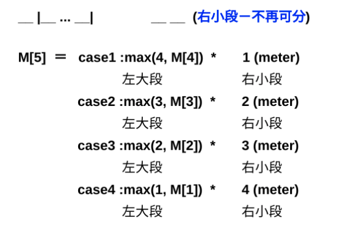

<!----- Conversion time: 1.404 seconds.


Using this Markdown file:

1. Cut and paste this output into your source file.
2. See the notes and action items below regarding this conversion run.
3. Check the rendered output (headings, lists, code blocks, tables) for proper
   formatting and use a linkchecker before you publish this page.

Conversion notes:

* Docs to Markdown version 1.0β14
* Wed Jan 16 2019 17:18:26 GMT-0800 (PST)
* Source doc: https://docs.google.com/open?id=1uvjunRF17ypweEj_7HVTcbtD74QFGtU3Ut_mdQmsKrg
* This document has images: check for >>>>>  gd2md-html alert:  inline image link in generated source and store images to your server.
----->


# Max Product of Cutting Rope

[https://app.laicode.io/app/problem/87](https://app.laicode.io/app/problem/87)


## Description

Given a rope with positive integer-length _n_, how to cut the rope into _m_ integer-length parts with length _p\[0\], p\[1\], ..., p\[_m_-1\]_, in order to get the maximal product of _p\[0\]p\[1\] ... p\[m-1\]_? m is determined by you and must be greater than 0 (at least one cut must be made). Return the max product you can have.

_Assumptions_


*   _n >= 2_

_Examples_


*   _n = 12, the max product is 3 3 3 3_ = 81(cut the rope into 4 pieces with length of each is 3).

Medium

Math


## Assumption

When the rope's length is 0 or 1, there is no way to cut them into two parts. So, the product of these two situations are 0 (0 * 0 and 1 * 0 or 0 * 1).

When the rope's length is 2, there is only one way to cut the rope, 1 and 1, which gives us a product of 1.


## Algorithm

If the length of the rope is n, we maintain an array of length (n + 1). The properties of this array include:


1.  at index i, product\[i\] represents the maximum product of a rope which has a length of i;
1.  product\[0] and product\[1] are both 0, product\[2] is 1 according to our assumptions.

We iterate over the rest of the rope \[3 → n]. At any length in that moment, when we cut the rope into two parts, we only consider further cuts on the first part and leave the second part as it is. For example, when the current length is 5:





M\[i] will need to be updated each time because there may be multiple situations, 1 * 4 vs. 2 * 3.


## Solution


### Linear scan & look back


#### Code


```java
public class Solution {
    public int maxProduct(int length) {
        // Write your solution here
        if (length < 2) {
            return length;
        }
        int[] product = new int[length + 1];
        product[1] = 0;
        product[2] = 1;
        for (int i = 3; i <= length; i++) {
            // For every length of i, we can cut it by sub lengths
            // from 1 to i - 1
            for (int j = 1; j < i; j++) {
                product[i] = Math.max(
                                product[i],
                                j * Math.max(product[i - j], i - j));
            }
        }
        return product[length];
    }
}
```


#### Complexity

Time:

Iteration from 3 to length: O(n).

Iteration from 1 to i - 1: O(n).

O(n^2)

Space:

int[] product ⇒ O(n)


### Linear scan & look back (Optimized)

The second for loop, search in length i, can be further optimized.

Since either part of the rope will have a length that is <= i / 2 after getting cut, we can pick the shorter part and just look for the max product of the longer part.

For the longer part, we can choose to either cut or not cut it. So, the max number we can get will be either (i - j) or product\[i - j].

In this way, we can decrease the number of iterations from (1 → i - 1) to (1 → i / 2).


```java
public class Solution {
    public int maxProduct(int length) {
        // Write your solution here
        if (length < 2) {
            return length;
        }
        int[] product = new int[length + 1];
        product[2] = 1;
        for (int i = 3; i <= length; i++) {
            // Leave the shorter part as it is and only look for the
            // max product of the longer part
            // So, we will only need to run from 1 to i/2
            for (int j = 1; j <= i / 2; j++) {
                product[i] = Math.max(
                                product[i],
                                j * Math.max(i - j, product[i - j]));
            }
        }
        return product[length];
    }
}
```


#### Complexity

Time:

Iteration from 3 to length: O(n).

Iteration from 1 to i/2: O(n/2).

O(n^2)

Space:

int[] product ⇒ O(n)


<!-- Docs to Markdown version 1.0β14 -->
