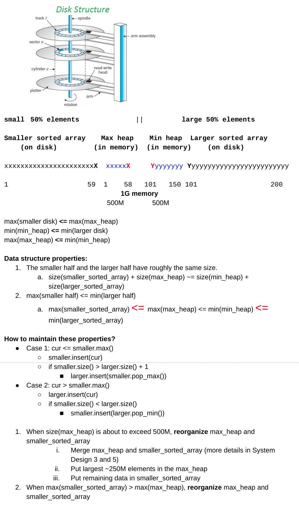

<!----- Conversion time: 0.921 seconds.


Using this Markdown file:

1. Cut and paste this output into your source file.
2. See the notes and action items below regarding this conversion run.
3. Check the rendered output (headings, lists, code blocks, tables) for proper
   formatting and use a linkchecker before you publish this page.

Conversion notes:

* Docs to Markdown version 1.0β14
* Mon Jan 21 2019 19:27:24 GMT-0800 (PST)
* Source doc: https://docs.google.com/open?id=1d1RkI70HSPhcAwHJA1sl4nIRo4rQPemvbnAx3cQBobk
----->


# Median Tracker

[https://app.laicode.io/app/problem/113](https://app.laicode.io/app/problem/113)


## Description

Given an unlimited flow of numbers, keep track of the median of all elements seen so far.

You will have to implement the following two methods for the class


*   read(int value) - read one value from the flow
*   median() - return the median at any time, return null if there is no value read so far

Examples


*   read(1), median is 1
*   read(2), median is 1.5
*   read(3), median is 2
*   read(10), median is 2.5
*   ......
*

Medium

Heap


## Assumption

The incoming data is a flow/stream of unlimited numbers.


## Algorithm

Data structure used: two heaps


1.  a max heap: store the smaller half of all the numbers read from the stream so far
1.  a min heap: store the larger half
1.  properties
    1.  the two halves have roughly the same size
        1.  small.size() == large.size() or
        1.  small.size() == large.size() + 1
    1.  small.max <= large.min

For each new element (x) that gets read


1.  compare
    1.  x <= small.max ⇒ insert x to the smaller half
    1.  x > small.max ⇒ insert x to the larger half
1.  adjust the sizes
    1.  if small.size() == large.size() or small.size() == large.size() + 1 ⇒ legal and skip
    1.  if small.size() > large.size() + 1 ⇒ large.offer(small.pop())
    1.  if small.size() < large.size() ⇒ small.offer(large.pop())

The median =


1.  even ⇒ (small.max + large.min) / 2
1.  odd ⇒ small.max


## Solution


### Code


```java
public class Solution {
  /**
   * Use two heaps:
   * a maxHeap that stores the smaller half of the input flow
   * a minHeap that stores the larger half
   */
  private Queue<Integer> smallHalf;
  private Queue<Integer> largeHalf;

  public Solution() {
    smallHalf = new PriorityQueue<>(Collections.reverseOrder());
    largeHalf = new PriorityQueue<>();
  }

  public void read(int value) {
    // Write your implementation here
    if (smallHalf.isEmpty() || value <= smallHalf.peek()) {
      smallHalf.offer(value);
    } else {
      largeHalf.offer(value);
    }
    // Maintain the heaps such that:
    // small.size() == large.size() || small.size() == large.size() + 1
    if (smallHalf.size() > largeHalf.size() + 1) {
      // Case 1: too many elements in the smaller half
      largeHalf.offer(smallHalf.poll());
    } else if (smallHalf.size() < largeHalf.size()) {
      // Case 2: too many elements in the larger half
      smallHalf.offer(largeHalf.poll());
    }
  }

  public Double median() {
    // Write your implementation here
    int totalSize = smallHalf.size() + largeHalf.size();
    if (totalSize == 0) {
      // Case 0: if there are no numbers
      return null;
    } else if (totalSize % 2 == 0) {
      // Case 1: if there are even number of numbers read
      return (double) ((smallHalf.peek() + largeHalf.peek()) / 2.0);
    } else {
      // Case 2: if there are odd number of numbers read
      return (double) smallHalf.peek();
    }
  }
}
```


### Complexity


#### Time

The read() method includes insert into PQ operations ⇒ O(log(n))

The median() method only calls the peek() method of the PQ's ⇒ O(1)


#### Space

Two PQ's used ⇒ O(n)


## Follow-up

If there are too many elements to store in memory, how to keep track of the median?

**_If something doesn't fit into memory ⇒ disk_**

**_Random access on disk is slow ⇒ sorted array_**





<!-- Docs to Markdown version 1.0β14 -->
